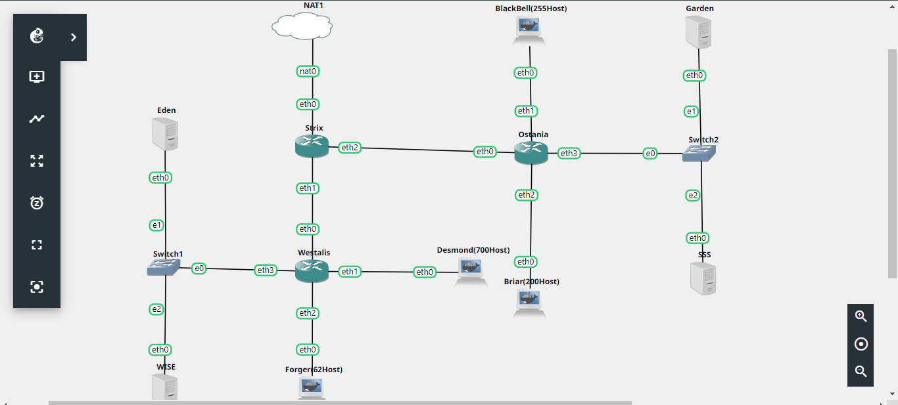

# Jarkom-Modul-4-F09-2022

## Anggota Kelompok

<table>
    <tr>
	    <th>Nama</th>
        <th>NRP</th>
    </tr>
    <tr>
        <td>Muhammad Lintang Panjerino</td>
        <td>5025201045</td>
    </tr>
    <tr>
        <td>Sayid Ziyad Ibrahim Alaydrus</td>
        <td>5025201147</td>
    </tr>
    <tr>
        <td>Wahyu Tri Saputro</td>
        <td>5025201217</td>
    </tr>
<table>

### A

Soal:

Tugas pertama kalian yaitu membuat topologi jaringan sesuai dengan rancangan yang diberikan Loid dibawah ini:

Jawab:



Keterangan :

    Eden adalah DNS Server
    WISE adalah DHCP Server
    Garden dan SSS adalah Web Server
    Jumlah Host pada Forger adalah 62 host
    Jumlah Host pada Desmond adalah 700 host
    Jumlah Host pada Blackbell adalah 255 host
    Jumlah Host pada Briar adalah 200 host
    Strix, Westalis, Ostania adalah DHCP Relay


### B
soal :

Untuk menjaga perdamaian dunia, Loid ingin meminta kalian untuk membuat topologi tersebut menggunakan teknik CIDR atau VLSM setelah melakukan subnetting.

jawab :

Pembagian subnet menggunakan VLSM. Berdasarkan topologi yang telah dibuat, dapat ditentukan labelling netmask sebagai berikut


### jumlah alamat IP

berikut ini adalah jumlah ip untuk masing-masing subnet yang telah ditentukan. Berdasarkan total jumlah IP untuk A1 hingga A8 pada tabel berikut, didapatkan netmask /21 sebagai netmask terbesar yang akan digunakan untuk pembagian IP.

<table>
    <tr>
	    <th>subnet</th>
        <th>jumlah ip</th>
        <th>netmask</th>
    </tr>
    <tr>
        <td>A1</td>
        <td>2</td>
        <td>/30</td>
    </tr>
    <tr>
        <td>A2</td>
        <td>2</td>
        <td>/30</td>
    </tr>
    <tr>
        <td>A3</td>
        <td>63</td>
        <td>/25</td>
    </tr>
    <tr>
        <td>A4</td>
        <td>24</td>
        <td>/24</td>
    </tr>
    <tr>
        <td>A5</td>
        <td>256</td>
        <td>/25</td>
    </tr>
     <tr>
        <td>A6</td>
        <td>701</td>
        <td>/22</td>
    </tr>
     <tr>
        <td>A7</td>
        <td>2</td>
        <td>/29</td>
    </tr>
     <tr>
        <td>A8</td>
        <td>2</td>
        <td>/29</td>
    </tr>
     <tr>
        <td>total</td>
        <td>1052</td>
        <td>/21</td>
    </tr>
    
<table>

### Tree


### C

Soal:

Anya, putri pertama Loid, juga berpesan kepada anda agar melakukan Routing agar setiap perangkat pada jaringan tersebut dapat terhubung

Jawab:

Routing yang dilakukan adalah _static routing_ yang dilakukan pada router Strix sebagai router utama. Routing diarahkan ke semua subnet di router Westalis dan router Ostania yang tidak terhubung secara langsung dengan router Strix. Hal ini dilakukan agar semua node dapat terhubung internet.

```
route add -net 10.33.4.0 netmask 255.255.252.0 gw 10.33.0.2
route add -net 10.33.0.128 netmask 255.255.255.128 gw 10.33.0.2
route add -net 10.33.0.8 netmask 255.255.255.248 gw 10.33.0.2

route add -net 10.33.2.0 netmask 255.255.254.0 gw 10.33.0.6
route add -net 10.33.1.0 netmask 255.255.255.0 gw 10.33.0.6
route add -net 10.33.0.16 netmask 255.255.255.248 gw 10.33.0.6
```

### D

Soal:

Tugas berikutnya adalah memberikan ip pada subnet Forger, Desmond, Blackbell, dan Briar secara dinamis menggunakan bantuan DHCP server. Kemudian kalian ingat bahwa kalian harus setting DHCP Relay pada router yang menghubungkannya

Jawab:

Untuk melakukan pembagian IP dengan cara DHCP maka diperlukan beberapa setting di DHCP Server dan DHCP Relay. Pada DHCP Server diperlukan pengaturan pada file `/etc/default/isc-dhcp-server` dan file `/etc/dhcp/dhcpd.conf`. Sedangkan pada DHCP Relay dilakukan setting pada file `/etc/default/isc-dhcp-relay`.

Pada `/etc/default/isc-dhcp-server`:

```
# On what interfaces should the DHCP server (dhcpd) serve DHCP requests?
# Separate multiple interfaces with spaces, e.g. "eth0 eth1".
INTERFACES="eth0"
```

Pada `/etc/dhcp/dhcpd.conf`:

```
# subnet A7
subnet 10.33.0.8 netmask 255.255.255.248{
}

# subnet A3
subnet 10.33.0.128 netmask 255.255.255.128 {
    range 10.33.0.130 10.33.0.254;
    option routers 10.33.0.129;
    option broadcast-address 10.33.0.255;
    option domain-name-servers 10.33.0.10;
    default-lease-time 360;
    max-lease-time 7200;
}

# Subnet A6
subnet 10.33.4.0 netmask 255.255.252.0 {
    range 10.33.4.2 10.33.7.254;
    option routers 10.33.4.1;
    option broadcast-address 10.33.7.255;
    option domain-name-servers 10.33.0.10;
    default-lease-time 360;
    max-lease-time 7200;
}

# Subnet A5
subnet 10.33.2.0 netmask 255.255.254.0 {
    range 10.33.2.2 10.33.3.254;
    option routers 10.33.2.1;
    option broadcast-address 10.33.3.255;
    option domain-name-servers 10.33.0.10;
    default-lease-time 360;
    max-lease-time 7200;
}

# Subnet A4
subnet 10.33.1.0 netmask 255.255.255.0 {
    range 10.33.1.2 10.33.1.254;
    option routers 10.33.1.1;
    option broadcast-address 10.33.1.255;
    option domain-name-servers 10.33.0.10;
    default-lease-time 360;
    max-lease-time 7200;
}
```

Setelah itu jangan lupa restart service DHCP Server

```
service isc-dhcp-server restart
```

Pada file `/etc/default/isc-dhcp-relay`:

```
# What servers should the DHCP relay forward requests to?
SERVERS="10.33.0.11"

# On what interfaces should the DHCP relay (dhrelay) serve DHCP requests?
INTERFACES="eth0 eth1 eth2 eth3"

# Additional options that are passed to the DHCP relay daemon?
OPTIONS=""
```

Setelah itu jangan lupa restart service DHCP Relay

```
service isc-dhcp-relay restart
```

### NO 1

Soal:

Agar topologi yang kalian buat dapat mengakses keluar, kalian diminta untuk mengkonfigurasi Strix menggunakan iptables, tetapi Loid tidak ingin menggunakan MASQUERADE

Jawab:

Karena konfigurasi pada router Strix tidak boleh memakai MASQUERADE, maka diperlukan beberapa hal. Pertama, setting pada `Configure -> Edit network configuration` khususnya pada interface yang terhubung dengan NAT, yaitu `eth0`. Kedua, menambahkan aturan iptables pada Strix.

Pada langkah pertama, `eth0` harus disetting IP Strix menjadi static dan disesuaikan dengan IP NAT. Karena IP NAT adalah 192.168.122.1, maka IP Strix dapat disetting menjadi 192.168.122.2 dengan netmask 255.255.255.252 atau /30. Address diisi IP Strix dan gateway diisi IP NAT.

Langkah kedua, dilakukan setting iptables dengan menggunakan POSTROUTING di mana akan mendifinisikan alamat asal dari paket yaitu semua alamat IP dari subnet 10.33.0.0/21 mengguanakan eth0 dan akan mengubah alamat asal paket menggunakan -j SNAT.

Konfigurasi `eth0` pada Strix

```
auto eth0
iface eth0 inet static
        address 192.168.122.2
        netmask 255.255.255.252
        gateway 192.168.122.1
        up echo nameserver 192.168.122.1 > /etc/resolv.conf
```

Konfigurasi iptables pada Strix

```
iptables -t nat -A POSTROUTING -o eth0 -j SNAT -s 10.33.0.0/21 --to-source 192.168.122.2
```

### NO 2

Soal:

Kalian diminta untuk melakukan drop semua TCP dan UDP dari luar Topologi kalian pada server yang merupakan DHCP Server demi menjaga keamanan.

Jawab:

Untuk melakukan drop semua TCP dan UDP dari luar topologi pada server yang merupakan DHCP Server (WISE / 10.33.0.11), dilakukan pengaturan iptables pada Strix sebagai router utama yang terhubung dengan luar topologi. Semua paket TCP dan UDP yang akan memasuki topologi yang menuju DHCP Server akan didrop oleh router Strix. Berikut adalah konfigurasi pada Strix.

```
iptables -A FORWARD -i eth0 -p tcp -d 10.33.0.11 -j DROP
iptables -A FORWARD -i eth0 -p udp -d 10.33.0.11 -j DROP
```

### NO 3

Soal:

Loid meminta kalian untuk membatasi DHCP dan DNS Server hanya boleh menerima maksimal 2 koneksi ICMP secara bersamaan menggunakan iptables, selebihnya didrop.

Jawab:

Untuk mebatasi koneksi ICMP ke DHCP dan DNS Server secara bersamaaan, diperlukan setting iptables menggunakan `connlimit`. Jika koneksi ICMP yang diterima oleh DHCP dan DNS Server lebih dari 2 maka akan didrop. Sehingga iptables yang diterapkan adalah sebagai berikut.

```
iptables -A INPUT -p icmp -m connlimit --connlimit-above 2 --connlimit-mask 0 -j DROP
```

Setting iptables di atas dilakukan pada DHCP Server (WISE) dan DNS Server (Eden).

Testing:

Pada testing kali ini akan dilakukan ping dari 3 client (BlackBell, Briar, Desmond) ke DHCP Server (WISE / 10.33.0.11) dan DNS Server (Eden / 10.33.0.10). Seharusnya client ke-3, Desmond, sudah tidak bisa ping ke DHCP dan DNS Server.

- WISE-BlackBell

  

- WISE-Briar

  

- WISE-Desmond

  

- Eden-BlackBell

  

- Eden-Briar

  

- Eden-Desmond

  

### NO 4

Soal:

Akses menuju Web Server hanya diperbolehkan disaat jam kerja yaitu Senin sampai Jumat pada pukul 07.00 - 16.00.

Jawab:

Pada Web Server, Garden dan SSS, dilakukan setting iptables sesuai dengan soal. Setting yang dilakukan dapat menggunakan beberapa cara, namun kali ini kami menggunakan 3 langkah untuk menjawab soal ini. Pertama, terima (ACCEPT) semua paket yang masuk (INPUT) ke Web Server pada Senin-Jumat pukul 07:00-16:00. Kedua, tolak (REJECT) semua paket pada Senin-Jumat. Ketiga, tolak (REJECT) semua paket pada Sabtu-Minggu. Setting berikut ini dilakukan pada semua Web Server, yaitu Garden dan SSS.

```
iptables -A INPUT -m time --timestart 07:00 --timestop 16:00 --weekdays Mon,Tue,Wed,Thu,Fri -j ACCEPT
iptables -A INPUT -m time --weekdays Mon,Tue,Wed,Thu,Fri -j REJECT
iptables -A INPUT -m time --weekdays Sun,Sat -j REJECT
```

Testing:

Pada testing kali ini, digunakan client BlackBell dan Web Server Garden. BlackBell akan melakukan ping ke Garden dengan IP Garden adalah 10.33.0.18

Testing akan dilakukan menjadi 3 skenario: Selasa 13:00, Selasa 20:00, dan Sabtu 12:00. Hasil yang diharapkan adalah skenario 1 berhasil (Bisa ping), skenario 2 gagal (Destination Port Unreachable), skenario 3 gagal (Destination Port Unreachable).

- Skenario 1

  

- Skenario 2

  

- Skenario 3

  
  
### NO 5

Soal:

Karena kita memiliki 2 Web Server, Loid ingin Ostania diatur sehingga setiap request dari client yang mengakses Garden dengan port 80 akan didistribusikan secara bergantian pada SSS dan Garden secara berurutan dan request dari client yang mengakses SSS dengan port 443 akan didistribusikan secara bergantian pada Garden dan SSS secara berurutan.

Jawab :

Untuk mengerjakan soal nomor 5, bisa menambahkan command di `root/script_ostania.sh`. Untuk command nya sendiri adalah sebagai berikut :

`iptables -A PREROUTING -t nat -p tcp --dport 80 -d 10.33.0.18 -m statistic --mode nth --every 2 --packet 0 -j DNAT --to-destination 10.33.0.19:80`

Script tersebut untuk yang mengakses Garden dengan port 80.

`iptables -A PREROUTING -t nat -p tcp --dport 443 -d 10.33.0.19 -m statistic --mode nth --every 2 --packet 0 -j DNAT --to-destination 10.33.0.18:443`

Dan script tersebut untuk yang mengakses SSS dengan port 443.

Untuk testing bisa menggunakan command `nc -l -p [PORT]` di reciever dan `nc [IP Receiver] [PORT]`


### Kendala

- Kesusahan untuk menemukan solusi no 6
